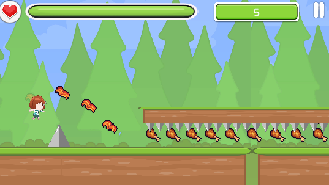

# 🏃‍♀️ 달려라 차라 (Run Chara)

**「달려라 차라」**는 Unity 기반으로 제작된 2D 횡스크롤 플랫포머 러닝 게임입니다.  
플레이어는 귀여운 캐릭터 '차라'를 조작하여 장애물을 피하고 다양한 아이템을 수집하면서 점프와 슬라이딩을 활용해 가능한 한 멀리 달리는 것이 목표입니다.

---

## 🎮 게임 특징

- **Z키**를 홀드하면 점프 높이를 조절할 수 있어 **롱점프**와 **숏점프**를 전략적으로 활용할 수 있습니다.
- **X키**를 홀드하면 슬라이딩이 가능하여, 낮은 장애물을 회피할 수 있습니다.
- 다양한 아이템을 수집하여 스코어를 높이고, 게임 상황에 변화를 줄 수 있습니다.

---

## 🧩 아이템 종류

| 아이템       | 효과                           |
|--------------|--------------------------------|
| 스코어 아이템 | 점수를 증가시킵니다.            |
| 힐 아이템     | 체력을 회복합니다.              |
| 스피드 업     | 일정 시간 동안 속도가 빨라집니다. |
| 스피드 다운   | 일정 시간 동안 속도가 느려집니다. |

---

## 🖼️ 게임 예시 이미지

---

## 🔧 조작 방법

| 조작키 | 기능 설명           |
|--------|--------------------|
| Z (홀드) | 점프 (길게 누를수록 높게 점프) |
| X (홀드) | 슬라이딩           |

---

## 📌 개발 정보

- **엔진**: Unity 2022.3.17f
- **장르**: 2D Side-scrolling Runner
- **플랫폼**: PC (Windows)

---

## 👥 팀 구성

| 역할 | 이름 | 담당 내용 |
|------|------|-----------|
| 팀장 | 김민수 | 프로젝트 관리 및 방향성 제시 |
| 팀원 | 김영진 | 아이템 및 오디오 시스템 제작 |
| 팀원 | 김영훈 | UI 제작 및 전체적 보조 |
| 팀원 | 서정원 | 맵 제작 및 애니메이션 제작 보조 |
| 팀원 | 함승우 | 캐릭터 이동, 애니메이션 제작 및 발표 |
| 아트/에셋 | 에셋 스토어 활용 |

---

## 💬 참고 사항

- 외부 무료 에셋 사용 시 라이선스를 준수하고, **깃 저장소에는 에셋 파일을 업로드하지 않습니다.**
- 팀원은 별도로 에셋스토어에서 직접 다운로드 받는 방식으로 협업합니다.

---

즐겁게 달려보세요!

# 재배포 금지 라이센스 에셋을 추가해야 합니다. (링크)
// 캐릭터
https://assetstore.unity.com/packages/2d/characters/easy-chara-hisa-2d-character-pack-313655

// UI
https://assetstore.unity.com/packages/2d/gui/icons/2d-casual-ui-hd-82080?srsltid=AfmBOooFnDd9-obxD2Ns1U7n1MYbTeOqLJAmMFwnt0JOYsT0lXddNQ-c#asset_quality 

// 아이템
https://assetstore.unity.com/packages/2d/environments/free-pixel-food-113523#publisher 

// 효과음
https://assetstore.unity.com/packages/audio/sound-fx/8-bits-elements-16848

// BGM
https://assetstore.unity.com/packages/audio/music/visual-love-bgm-all-in-one-pack-318268

//타일맵
https://assetstore.unity.com/packages/2d/environments/pixel-art-top-down-basic-187605
